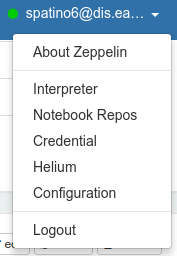
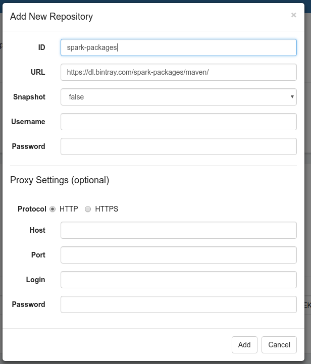
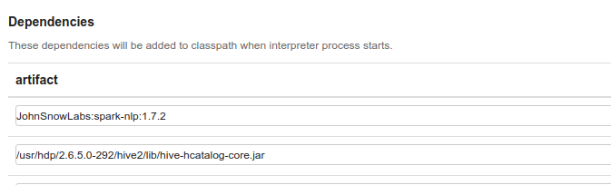

# BigDataProject

## Flume
### Instalar y Configurar Flume

1. Descargar Flume [Aqui](http://flume.apache.org/download.html).

2. Mover [flume-sources-1.0-SNAPSHOT.jar](https://github.com/lmarinl1/BigDataProject/blob/master/lib/flume-sources-1.0-SNAPSHOT.jar) al  classpath, y ubicar dicho fichero en **conf/flume-env.sh**.

```
$ EXPORT JAVA_HOME=/usr/lib/jvm/java-7-openjdk-amd64`
$ EXPORT FLUME_CLASSPATH=/usr/hdp/current/flume-server/lib/flume-sources-1.0-SNAPSHOT.jar
```
Este .jar contiene todas las clases necesarias de java para extraer los Tweets e incertarlos en un lugar de HDFS.


### Archivo de configuración de un agente de Flume

El archivo se llama [twitter.conf](https://github.com/lmarinl1/BigDataProject/blob/master/twitter.conf) el cual debe tener todas las configuraciones del agente (flume, memory and hdfs) y se define de la siguiente manera:

**Parte 1:** Nombrar los componentes del agente a configurar
```
TwitterAgent.sources = Twitter  
TwitterAgent.channels = MemChannel 
TwitterAgent.sinks = HDFS    
```

**Parte 2:** Descripcion y configuracion de la fuente
```
TwitterAgent.sources.Twitter.type = com.cloudera.flume.source.TwitterSource 
TwitterAgent.sources.Twitter.consumerKey = <CustomerKey>
TwitterAgent.sources.Twitter.consumerSecret = <ConsumerSecret> 
TwitterAgent.sources.Twitter.accessToken = <AccessToken>
TwitterAgent.sources.Twitter.accessTokenSecret = <AccessTokenSecret>
TwitterAgent.sources.Twitter.keywords = Pepsi, Coca-cola
```

**Parte 3:** Descripcion de la sincronizacion
```
TwitterAgent.sinks.HDFS.type = hdfs  
TwitterAgent.sinks.HDFS.hdfs.path = hdfs://sandbox-hdp.hortonworks.com:8020/user/<userName>/twitter
TwitterAgent.sinks.HDFS.hdfs.fileType = DataStream  
TwitterAgent.sinks.HDFS.hdfs.writeFormat = Text  
TwitterAgent.sinks.HDFS.hdfs.batchSize = 1000 
TwitterAgent.sinks.HDFS.hdfs.rollSize = 0  
TwitterAgent.sinks.HDFS.hdfs.rollCount = 10000 
```

**Parte 4:** Configuracion del canal
```
TwitterAgent.channels.MemChannel.type = memory  
TwitterAgent.channels.MemChannel.capacity = 10000  
TwitterAgent.channels.MemChannel.transactionCapacity = 100 
TwitterAgent.sources.Twitter.channels = MemChannel 
TwitterAgent.sinks.HDFS.channel = MemChannel
```

Los componentes de *\<consumerKey>*, *\<consumerSecret>*, *\<accessToken>* y *\<accessTokenSecret>* deben ser reemplazados con los elementos obtenidos desde una app de twitter ([Obten una App](https://dev.twitter.com/apps)). y TwitterAgent.sinks.HDFS.hdfs.path es la direccion a donde iran todos los Tweets estraidos. 

> *Nota:* Aunque HDFS es considerado sin esquema, o más bien *Scheme On Read*, los Tweets son almacenados en un formato JSON en la dirección propuesta previamente, cada uno puede verse como un documento individual desde una interfaz gráfica como Ambari.

Los valores de TwitterAgent.sources.Twitter.keywords pueden ser modificados para obtener otras temáticas de los Tweets como por ejemplo: Futbol, Peliculas, Colombia, etc. 


### Variables de inicializacion de FLUME 
Agregar las siguientes al archivo `.bashrc`:

```
export FLUME_HOME=/home/ultron/work/apache-flume-1.6.0-bin
export FLUME_CONF_DIR=$FLUME_HOME/conf
export FLUME_CLASSPATH=$FLUME_CONF_DIR
export PATH=”$FLUME_HOME/bin:$PATH”
```

### Ejecutar Flume y Recolectar Tweets para poner dentro de HDFS.

1. En primera instacia poner a ejecutar Hadoop
```
$ start-all.sh
```
2. Iniciar Flum con el siguiente comando
```
$ flume-ng agent --conf . -f twitter.conf -Dflume.root.logger=DEBUG,console -n TwitterAgent
```
3. Después de unos minutos los Tweets deberían aparecer en la ubicación dada de HDFS
Para el caso:
```
$ hdfs dfs -ls /user/dfonseca/twitter
```

## Spark-NLP

### Instalación

Para instalar la bilbioteca de [Spark-NLP](https://nlp.johnsnowlabs.com) en consola se pueden seguir los pasos descritos en su página web, en <https://nlp.johnsnowlabs.com/quickstart.html>.

Para su instalación de Zeppelin, seguir los pasos aquí descritos:

1. Ingresar a Zeppelin y buscar la opción Interpreter en el menú de usuario en la esquina superior derecha, tal como se ve en la imagen 1.



2. Agregar el repositorio de los paquetes de Spark a la lista de repositorios de Zeppelin haciendo click en el botón Repository y después en el botón +. En el formulario que aparece después de esto llenar el campo id con un nombre para identificar el repositorio y en url copiar la dirección <https://dl.bintray.com/spark-packages/maven/> tal como se ve en la imagen 2.



3. Buscar el interprete de la versión a utilizar de Spark (en nuestro caso spark2), darle click al botón edit y agregar el paquete *JohnSnowLabs:spark-nlp:1.7.2* y el jar ubicado en la dirección */usr/hdp/2.6.5.0-292/hive2/lib/hive-hcatalog-core.jar* en la lista de dependencias, tal como se ve en la imagen 3. Este último es para compatibilidad con el formato utilizado para formar la tabla en Hive de los tweets recuperados anteriormente.



4. Guardar los cambios y probar el código en Zeppelin.
